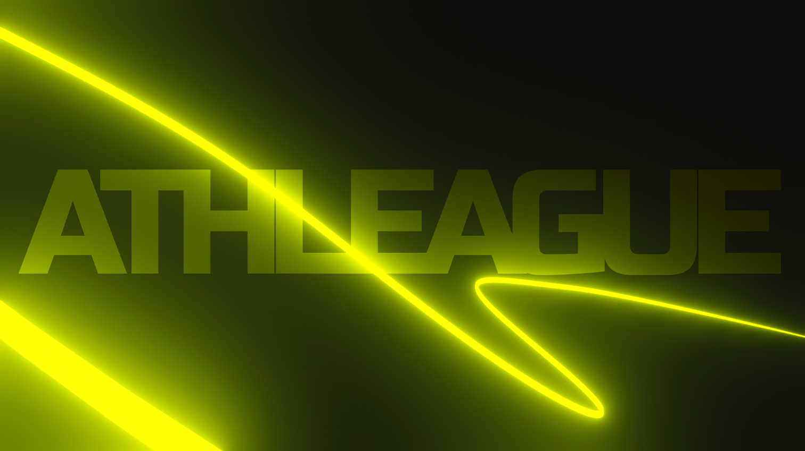

# Athleague

A outdoor adventure game made to encourage local exploration and improve personal fitness.

## How to Play

### Create Courses

In *Course Creation* mode, you can tap the map to place up to 50 checkpoints. Explore near you or places far away, but keep in mind how long it will take to travel between each checkpoint. If too far, other players will likely not attempt your course.

### Compete

Take the top of the leaderboard by completing as many courses as fast as you can.

### Complete

Track your progress and improve your fitness by completing challenges with or without being timed or playing against others.

## Demo

  

## FAQ

- How do you complete a course?

> With your tracking device (i.e. phone or other), locate and travel to each checkpoint in consecutive order.

- Are there different game modes?

> The M.V.P. will have only one gamemode, which is "consecutive checkpoint", but there will be other ways to play based on real-world adventure race games.

- Is my location shared with others?

> TODO

## Contributing

Any and all contributions are welcome. Feel free to get in contact.
